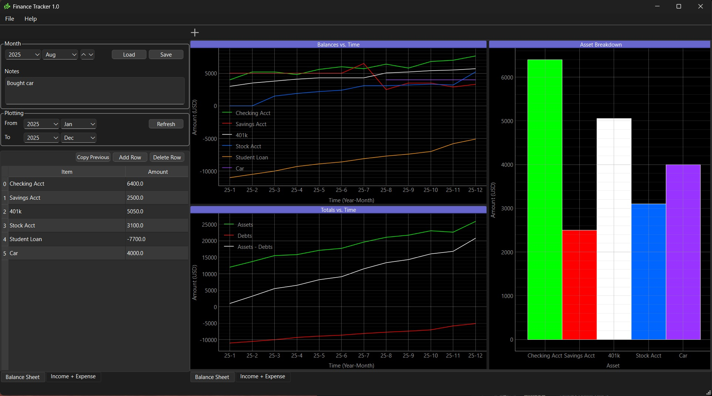

#  Personal Finance Tracker

This is a desktop application for tracking personal finances, built using the [PySide6](https://doc.qt.io/qtforpython-6/) Qt Python binding.



### Features
The 2 main features of the program are:
- A balance sheet, to manually track assets and debts over the long term
- An income expense sheet, to process banking and credit card data and categorize individual transactions
    - Categorization of transactions is done using a local AI prompt through [Ollama](https://ollama.com/), where initial category assignments are guessed based off transaction descriptions

For both the balance sheet and income expense sheet, data is tracked by month, and basic metrics are calculated like total assets, total debts, total income, total expenses, etc. Data is visualized using [PyQtGraph](https://pyqtgraph.readthedocs.io/en/latest/#) using flexible dock areas, which allows the plots to be interactively resized or detached from the main window.

The programs finance data is saved to a database file using compressed Numpy binary format. Use the 'Workspace Directory' feature to define where this will be kept. In the repo the "sample data" folder includes some fictional data that can be read in as a demo.

### Running From EXE
Run ```pyside_app_demo.exe```

### Running From Source
Run ```main.py```

### Code Guide
The UI layout has been build using the Qt Designer tool, which allows components to be arranged through drag and drop. The ui is then compiled and imported into ```main.py```, which builds and runs the main window, along with defining general app properties and UI helper functions. Further separate helpers functions are housed separately under the ```utils``` folder, supporting plotting, calculation of metrics per month, and status update features including fading status messages, and progress bars with windows taskbar integration.

Compilation is ran through ```pyside6-deploy```, and then further packaging of that executable into a traditional installer is done using [Inno Setup](https://jrsoftware.org/isinfo.php).
